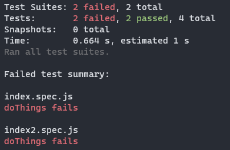

# summary-reporter

A jest reporter showing you which files and tests failed, and nothing more.

Usage:

```shell
$ npm install summary-reporter

$ npx jest --reporters summary-reporter
```

Example output:



Everything from "Failed test summary:" onward is summary-reporter.